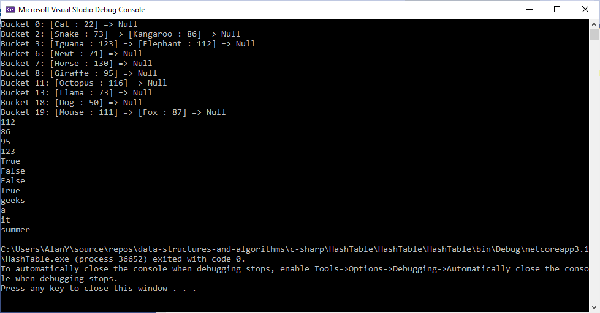

# Code Challenge: Class 30: Hash Table Implementation

## Author: Alan Hung

### Challenge Summary
* Create a HashMap class that creates an array of Linked Lists to represent a table that stores Key Value Pairs
* Within your Hash Map class, include a Linked List of Key Value Pairs of strings property. Upon instantiation, an empty Hash Map should be created.
  * Define a method called Hash which given a string will convert it into an index for the Hash Map Table.  It returns -1 if an empty string is provided for the key.
  * Define a method called Add which uses Hash to get the position of the Table to store Key Value Pair data.
  * Define a method called Get which uses Hash to get the position of data inside the Hash Table, then traverses the memory location to find the key value pair to return the data.
  * Define a method called Get which uses Hash to get the position of data inside the Hash Table, then traverses the memory location to find the key value pair to tell the user if the data is already stored within the Hashmap.

### Challenge Summary Part 2
* Write a method called FirstRepeatedWord that given a long string will parse the string and return the first word in the string that shows up more than once.  It returns null if no duplicates are found.
* Write a method called TreeIntersection that given 2 trees will traverse both trees and return a list of all collision values
* Write a method called LeftJoin that given 2 HashMaps will mimic the functionality of a SQL Left Join Operation and return a list of the resulting data

### Challenge Description
* Create a Hash Map with a working hash, add, get, and contains methods
* Create FirstRepeatedWord method that returns the first word to repeat more than once.
* Create TreeIntersection method that returns a list of intersecting values of two different trees
* Create LeftJoin method that returns a list of combined data between 2 hash maps

### Approach & Efficiency
* Create a Hash Map Class with an array that stores linked list key value pair strings.
* __Hash__ takes in a string and converts it into an int value.
  * Efficiency: O(n)
* __Add__ takes in a key and a value and hashes an address location from the key, then adds the key value pair into the table at address location.  If location is not empty, adds data to beginning of list.
  * Efficiency: O(1)
* __Get__ takes in a key and hashes an address location.  Then if location is not empty, will traverse the location to find the key value pair and return the value.
  * Efficiency: O(n)
* __Contains__ takes in a key and hashes an address location.  Then if location is not empty, will traverse the location to find the key value pair and return a boolean indicating if the value was found.
  * Efficiency: O(log n)
* __FirstRepeatedWord__ Takes in a long string, parses the string, then hashes the words to a Hash Map.  It then returns the first duplicate word it finds or it returns null.
  * Efficiency: O(n)
* __TreeIntersection__ Takes in 2 separate trees, then traverses both trees and returns a list of all intersecting values.  Returns null or empty list for edge cases.
  * Efficiency: O(n)
* __LeftJoin__ Takes in 2 separate hash maps, then combines the data in both maps and returns a list of all resulting combined data.  Returns empty list for edge cases.
  * Efficiency: O(Nlogn)

### Solution
* [First Repeated Word - Whiteboard](./HashTable/HashTable/assets/repeated-word.png)
* [Intersecting Trees - Whiteboard](./HashTable/HashTable/assets/TreeIntersection.PNG)
* [Left Join - Whiteboard](./HashTable/HashTable/assets/left-sort.png)

### Example

### Change Log
* 0.2.0 - 2/22/2021 11:33pm - Created HashMap Class with Hash Method
* 0.4.0 - 2/22/2021 11:33pm - Created Add Method
* 0.6.0 - 2/22/2021 11:33pm - Created Get Method
* 0.8.0 - 2/22/2021 11:33pm - Created Contains Method
* 1.0.0 - 2/22/2021 11:33pm - Created Program to test all Methods
* 1.1.0 - 2/22/2021 11:33pm - Created FirstRepeatedWord Method
* 1.2.0 - 2/22/2021 11:14pm - Created TreeIntersection Method
* 1.3.0 - 2/22/2021 12:04am - Created LeftJoin Method

### Attribution
* [Microsoft Docs](https://docs.microsoft.com/en-us/dotnet/csharp/language-reference/)
