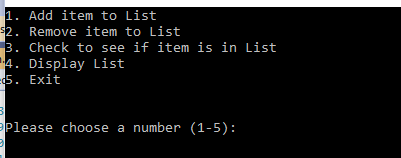
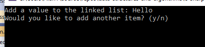
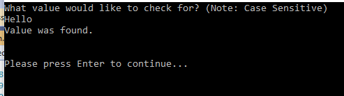
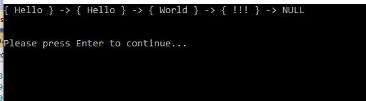

# Code Challenge: Class 05: Linked List Implementation

## Author: Alan Hung

### Challenge Summary
* Create a Node class that has properties for the value stored in the Node, and a pointer to the next Node.
* Within your LinkedList class, include a head property. Upon instantiation, an empty Linked List should be created.
  * Define a method called insert which takes any value as an argument and adds a new node with that value to the head of the list with an O(1) Time performance.
  * Define a method called includes which takes any value as an argument and returns a boolean result depending on whether that value exists as a Node’s value somewhere within the list.
  * Define a method called toString (or __str__ in Python) which takes in no arguments and returns a string representing all the values in the Linked List, formatted as:
    * "{ a } -> { b } -> { c } -> NULL"

### Challenge Summary Part 2
* Create an append method as part of the LinkedList Class that adds new items to the end of the list.
* Create an insertBefore method that will search for a list item and insert a new Node before that list item
* Create an insertAfter method that will search for a list item and insert a new Node after that list item

### Challenge Description
Create a functioning Linked List with insert, display, and search functionality.

### Approach & Efficiency
* Create a Node Class with value and pointer.
* Create a Linked List class with head pointer and to instantiate an empty list.
* __insert__ create a new node and set pointer to the Head's next node, and reset Head to new Node.
  * Efficiency: O(1)
* __includes__ create a pointer to traverse the list until you find value or reach end of list
  * Efficiency: O(n)
* __toString__ create a pointer to traverse the list and pull out the value.  Then append to string. Return the string.
  * Efficiency: O(n)

### Solution
* [Append - Whiteboard](./assets/append.png)
* [insertBefore - Whiteboard](./assets/insert_before.png)
* [insertAfter - Whiteboard](./assets/CodeChallenge06-insertafter.pdf)

### Example
* 
* 
* 
* 

### Change Log
* 0.1.0 - 1/15/2021 2:00pm - Created Node Class and LinkedList Class
* 0.2.0 - 1/15/2021 2:30pm - Created user menu
* 0.3.0 - 1/15/2021 3:00pm - Created insert prompt and function
* 0.4.0 - 1/15/2021 3:30pm - Created includes function
* 0.5.0 - 1/15/2021 4:00pm - Created toString function
* 0.6.0 - 1/15/2021 4:30pm - Added Exception Handling
* 0.7.0 - 1/15/2021 5:00pm - Added delete menu
* 0.9.0 - 1/15/2021 6:00pm - Added delete function
* 1.0.0 - 1/15/2021 8:00pm - Finshed creating and running tests.

### Attribution
* [Microsoft Docs](https://docs.microsoft.com/en-us/dotnet/csharp/language-reference/)
* [Stack Overflow](https://stackoverflow.com/questions/2695444/clearing-content-of-text-file-using-c-sharp)
