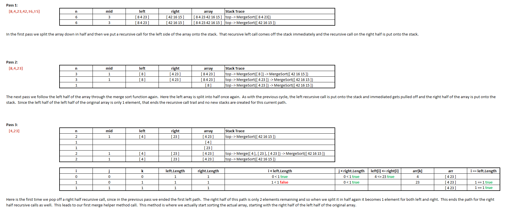

# __Merge Sort__
Merge Sort is a sorting algorithm that takes in an unsorted array of integers and splits it in half
into two new arrays. It continues to do this recursively until the array has been split into many
arrays holding only one integer.
It then begins pass the pieces into a helper method that starts merging them back together putting
the smaller values to the left of a return array. It does this until all pieces have been merged
back into the return array leaving a sorted array.

## __Pseudocode__

```
  ALGORITHM Mergesort(arr)
      DECLARE n <-- arr.length
           
      if n > 1
        DECLARE mid <-- n/2
        DECLARE left <-- arr[0...mid]
        DECLARE right <-- arr[mid...n]
        // sort the left side
        Mergesort(left)
        // sort the right side
        Mergesort(right)
        // merge the sorted left and right sides together
        Merge(left, right, arr)

  ALGORITHM Merge(left, right, arr)
      DECLARE i <-- 0
      DECLARE j <-- 0
      DECLARE k <-- 0

      while i < left.length && j < right.length
          if left[i] <= right[j]
              arr[k] <-- left[i]
              i <-- i + 1
          else
              arr[k] <-- right[j]
              j <-- j + 1
            
          k <-- k + 1

      if i = left.length
         set remaining entries in arr to remaining values in right
      else
         set remaining entries in arr to remaining values in left
```

## __Trace__




## Efficiency
  * Time: O(Nlogn)
    * BigO time for merge sort is O(n*Log n) because it divide the array into halves and sorting happens as the halves are brought back together.
  * Space: O(n)
    * BigO space for merge sort is O(n) because no matter how many arrays you end up splitting the original array into you will still have the same amount of index values as the original array.
