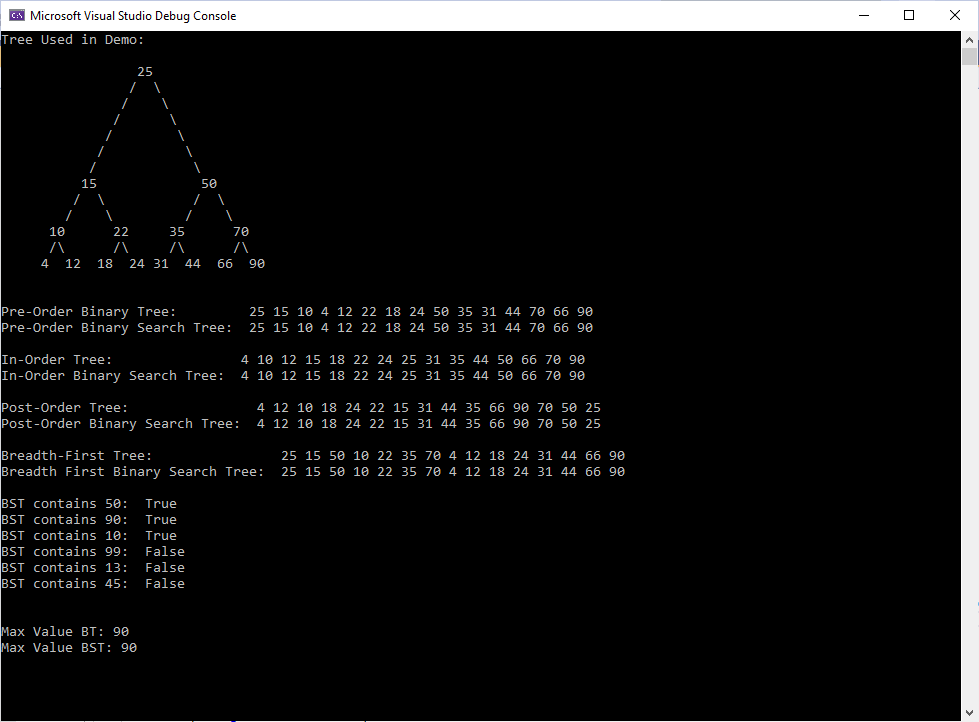

# Code Challenge: Class 15: Binary Tree Implementation

## Author: Alan Hung

### Challenge Summary
* Create a Node class that has properties for the value stored in the Node, and a pointer for a left and right child.
* Within your Binary Tree class, include a root property. Upon instantiation, an empty Binary Tree should be created.
  * Define a method called preOrder which takes a node and a dynamic array as an argument and returns a dynamic array containing the Binary Tree Nodes in preorder traversal order.
  * Define a method called inOrder which takes a node and a dynamic array as an argument and returns a dynamic array containing the Binary Tree Nodes in inorder traversal order.
  * Define a method called postOrder which takes a node and a dynamic array as an argument and returns a dynamic array containing the Binary Tree Nodes in postorder traversal order.
* Within your Binary Search Tree class, include a Binary Tree Property. Upon instantiation, an empty Binary Tree should be created.
  * Define a method called add that takes in a value as an argument and adds it to the Binary Tree in sorted order.
  * Define a method called contains that takes in a value as an argument and returns a boolean of whether or not the value is contained within the tree.
* Within your K-ary Tree class, include a List of Node References for the Children and a value to set the maximum number of children.

### Challenge Summary Part 2
* Write a method called Find-Maximum-Value that searches through a Binary Tree and returns the largest value in the tree.
* Write a method called BreadthFirst that traverses a tree using Breadth First Search and returns a List of Node Values in Search order.
* Write a method called FizzBuzz that copies a K-ary tree of int and replaces converts it to a tree of string.

### Challenge Description
* Create a Binary Tree with a working preorder, inorder, and postorder traversal methods
* Create a Binary Search Tree with a working add and contains method.
* Create a method called FindMaximumValue in the Binary Tree class and have it return the largest value in the tree.
* Create a method called BreadthFirst in the Binary Tree class and have it return a list of all values using BFS traversal order.
* Create a method called FizzBuzz tree that converts an int tree to a string and replaces all values divisible by 3 and 5 by "Fizz", "Buzz", and "FizzBuzz".

### Approach & Efficiency
* Create a Node Class with value and pointer to the left and right child.
* Create a Binary Tree class with head pointer and to instantiate an empty list.
* __PreOrder__ traverses the Binary tree using PreOrder traversal and returns a List
  * Efficiency: O(n)
* __InOrder__ traverses the Binary tree using InOrder traversal and returns a List
  * Efficiency: O(n)
* __PostOrder__ traverses the Binary tree using PostOrder traversal and returns a List
  * Efficiency: O(n)
* Create a Binary Search Tree class with a Binary Tree property and to instantiate an empty list.
* __Add__ Creates a new node that contains a new value and adds it to the Binary Search Tree in sorted order.
  * Efficiency: O(log n)
* __Contains__ Checks if a value is stored within the Binary Search Tree
  * Efficiency: O(log n)
* __FindMaximumValue__ Takes in no parameters, but uses an overloaded/helper function with node and value parameters to recursively search for the largest value in a tree and returns that value.
  * Efficiency: O(n)
* __BreadthFirst__ Takes in no parameters, but returns a List of nodes in Breadth First Traverse order.
  * Efficiency: O(n)
* __FizzBuzz__ Takes in a K-ary Tree of type int, but returns a a K-ary Tree of type string.

### Solution
* [Find Max Value in Tree - Whiteboard](./tree/tree/assets/FindMaxValueWhiteboard.PNG)
* [Breadth First Traversal - Whiteboard](./tree/tree/assets/BreadthFirstCC17wb.PNG)
* [K-ary Tree / FizzBuzz Tree - Whiteboard](./tree/tree/assets/k-ary-fizzbuzz.png)

### Example

### Change Log
* 0.2.0 - 1/31/2021 10:00pm - Created Node Class, Binary Tree Class, and PreOrder Traverse method
* 0.4.0 - 1/31/2021 10:05pm - Created InOrder Traverse method
* 0.6.0 - 1/31/2021 10:10pm - Created PostOrder Traverse method
* 0.8.0 - 1/31/2021 11:00pm - Created Binary Search Tree Class and Add method
* 1.0.0 - 1/31/2021 11:30pm - Created Contains method
* 1.1.0 - 2/01/2021 11:40pm - Created FindMaximumValue method
* 1.2.0 - 2/02/2021 1:00am - Created Breadth First Traversal method

### Attribution
* [Microsoft Docs](https://docs.microsoft.com/en-us/dotnet/csharp/language-reference/)
* [Geeks for Geeks](https://www.geeksforgeeks.org/tree-traversals-inorder-preorder-and-postorder/)
